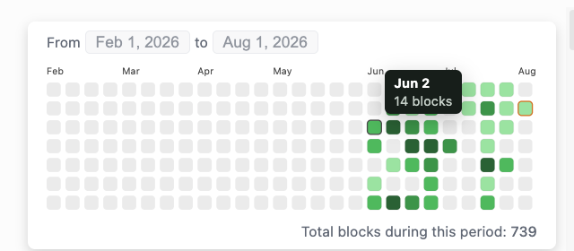

# DB Activity Heatmap

Shows how many blocks you create each day across your Logseq DB graph.

## Usage

1. Install the plugin from the Logseq Marketplace.
2. Select the grid icon in the toolbar.
3. Hover over a day to see its block count.
